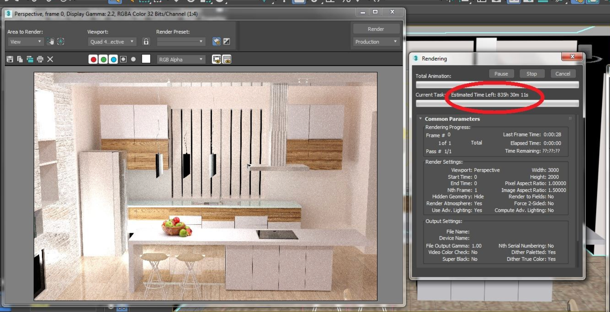
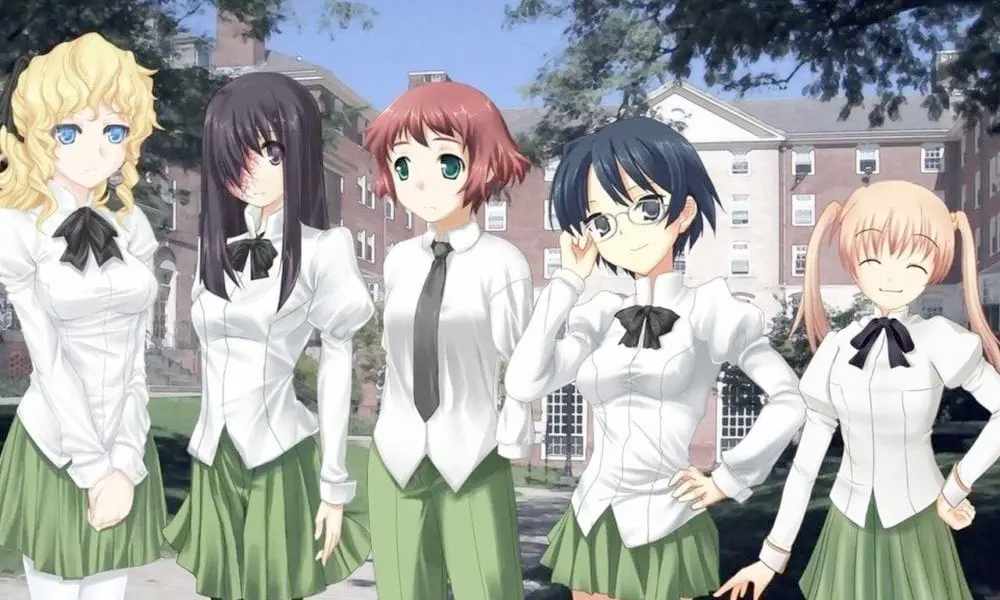
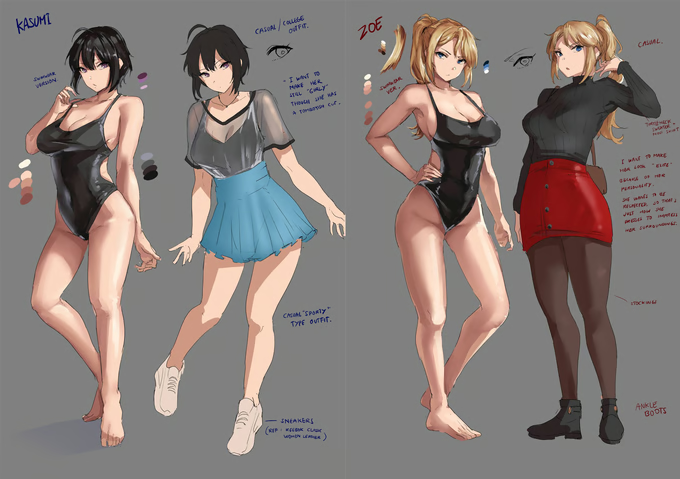
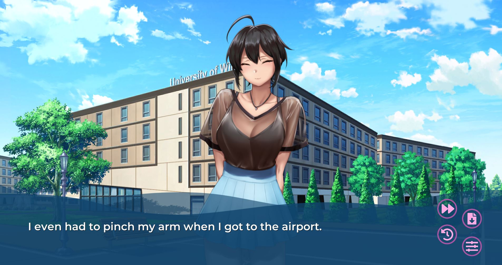
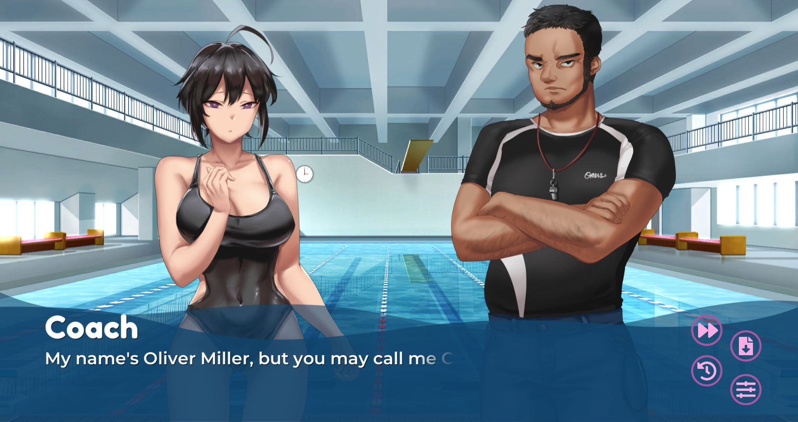
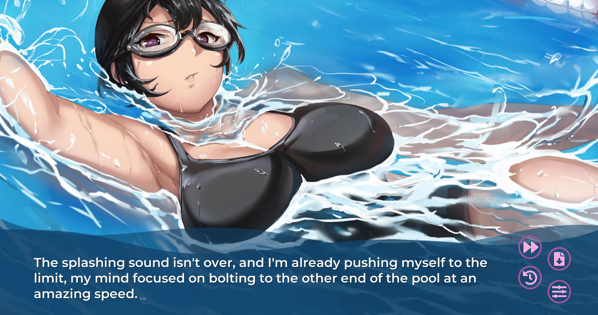
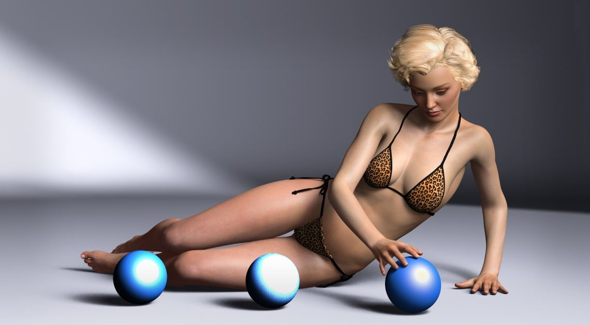
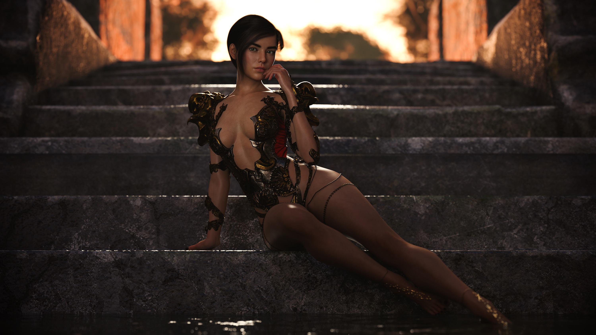
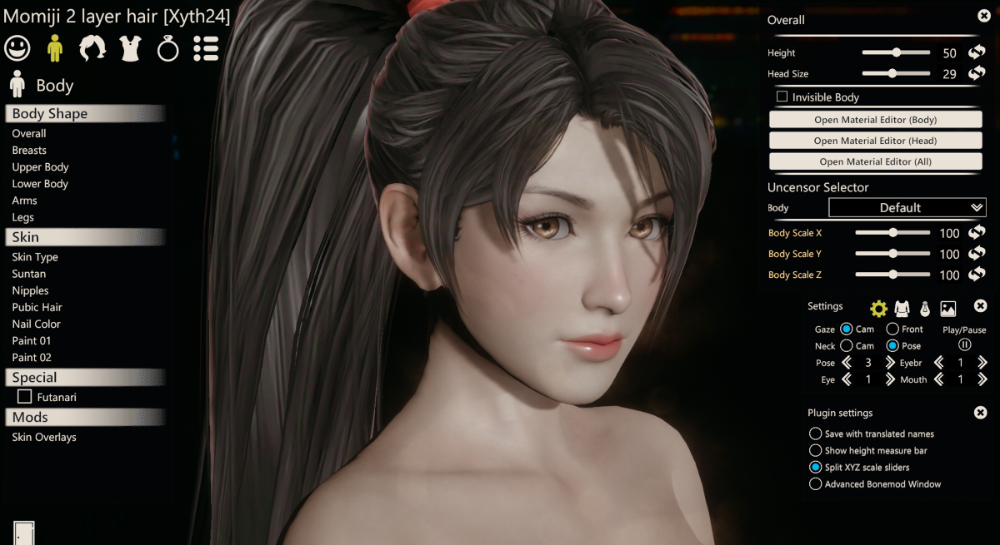

# The Art

_Any developer can tell you that the part that takes the longest is the art._

> 

There's a few different ways to go about doing the art, but the most important thing is making sure you like the style and making sure that it's not completely out of your control. Partnering with an unreliable artist, working in a medium that takes an exorbitant amount of time, or making an art style that you don't like _are all recipes for an incomplete game_. Before we go into what options are popular amongst devs, let's cover hand-drawn art first.

## Hand-drawn Art

Handrawn art has the appeal of being entirely customizable and a fan base that specifically loves to see handrawn art.

The art is not limited by the proportions of a character, lighting, shading, or anything else that comes with rendering from 3D models. But unless you're an artist or you have a close artist friend... _you're probably on your own to make your own art_. While it _is_ possible to commission your own art from the get go, very few successful AVNs are made this way. That's because unlike JAVNs and other games, most AVNs are made 'as you go' and do not have the monetary means to pay for an artist that is talented with the free time to dedicate to an open ended project.

Because of the time and effort required to hand-draw art, we almost exclusively see 2D sprites used. The process usually begins with a character reference sheet of different angles, expressions, and proportions of the character(s) based off of the details provided to the artist.

This is then used to create sprites with different expressions that get posted on a variety of backgrounds.

### Kasumi @ School BG

> 

### Kasumi & Coach @ Pool BG

> 

For more important scenes, notably scenes that contain sexual content, artists will render unique CGs or animations. How many CGs show up in a game depends on the size, scope, and budget of the project, and of course the artist themselves.

### Kasumi Swimming CG

> 

Hand-drawn art has a large appeal and there's people willing to pay a premium for that. These games have a substantial following on Kickstarter where supporters may pay upfront for completely hand-drawn AVNs - an idea that is almost unseen in the 3DCG AVN community so far.

## 3D Computer Graphics (3DCG)

Outside of handmade art, the dominant method is to create 3DCG renders. This is done by placing art and character assets in a 3D work space, then positioning a camera to take a 2D image or animation of that 3D world. While this might sound a lot harder than hand-drawn, the assets and characters are reusable, as are the 3D environments (scenes) that you setup.

In order to produce a final render, we need to:

- Create, purchase, or otherwise source the art assets
- Pose, light, apply FX, and render the scenes

There are extremely few, _if any_, devs that create all of their own original 3D assets. Creating enough 3D assets for an entire game takes a long time, even for a skilled artist. Because of this, most devs tend to use 3D character builders to design their own characters and then use free assets, community created assets, or buy assets from a market place to fill out their world.

While generic art assets can be found at a relatively cheaper price, characters can be very pricey due to the complexity and custom requirement of each character. Moreover, these characters also need to be [rigged](https://www.youtube.com/watch?v=c1iv0dbtMJ4) for both their skeletons and their faces so that their bodies and expressions can be adjusted throughout the scenes. As a result, almost every single dev creating a game with 3D renders uses a character creators.

## Character Creators

There are several popular free character creators that allow characters to be created and used, either in the same engine it was created in, or exported - to be used in anywhere the creator sees fit. These 3D model creators all come with their own styles, as well as pros and cons, so it's good to know that one creator is not strictly better than another. That being said, we'll begin with DAZ Studio.

**_Note: The pros and cons listed here are strictly related to these engines as character creators, not as rendering engines._**

### Daz Studio

[DAZ ](https://www.daz3d.com/technology/)is the most popular 3DCG engine for Western AVNs. That's not a disclaimer of it being the best, it's simply a fact as of the time of this writing.

DAZ occasional gets criticism for having uncanny characters, like this one here.

But as a wise man once said, it's _not the weapon, but the wielder_. Check out this render, also made in DAZ.

#### Pros

- It's probably the easiest to pick up and learn.
- Most people don't export models from DAZ so their entire workflow is in a single engine.
- You gain full ownership over the characters created and can legally use them in your own games.
- It has a more realistic look compared to 'anime-style' character creators.

#### Cons

- It can have an [uncanny valley](https://en.wikipedia.org/wiki/Uncanny_valley) look when not done properly.
- It is _not_ an industry software and some people find the models limiting or unoptimized.

---

### Koikatsu/Honey Select

Games like [Koikatsu](https://wiki.anime-sharing.com/hgames/index.php?title=Koikatu) (KK) and [Honey Select](https://wiki.anime-sharing.com/hgames/index.php?title=Honey_Select) (HS) are adult video games created by the studio [Illusion](<https://en.wikipedia.org/wiki/Illusion_(company)>). Originally made as a game and character builder, both games have seen extensive modding support by the community which has essentially made them 3DCG engines in themself (more on that later). While Koikatsu and Honey Select are separte games, they often get grouped together due to the similarity in their engines, communities, and the fact that many mods created for them work for both games.

KK characters possess a traditional anime-style.

> 

HS characters, on the other hand, possess a more realistic Asian/anime fusion style.

> 

While these might seem like niche, amateur, or even illegitimate tools, Koikatsu and Honey Select have a surprisingly varied eco system of creators and interests. They can be used to make characters following the style of Genshin Impact, Honkai Star Rail, various anime, and even Western cartoons characters.

#### Pros

- Probably the best and most supported engines for video game and anime characters.
- The models are beautiful and very straight forward to make.
- Modders supply a huge variety of free assets, clothing, and character templates.
- The community is _extremely_ helpful and supportive with all issues.

#### Cons

- Purchasing, downloading, and installing the game and mods can be difficult.
- These games are not officially supported anymore so any help you get will have to be through community posts on Discord or obscure forums.
- Exporting characters from Koikatsu/Honey Select may be difficult for people choosing to render in another engine.
- Games created with these characters cannot be sold on Steam due to copyright issues.

Note: Honey Select is a little different than Honey Select 2, but more on that elsewhere.

:::tip
What's recommended is going with whatever character art style that you prefer. You should always make what you like!
:::
