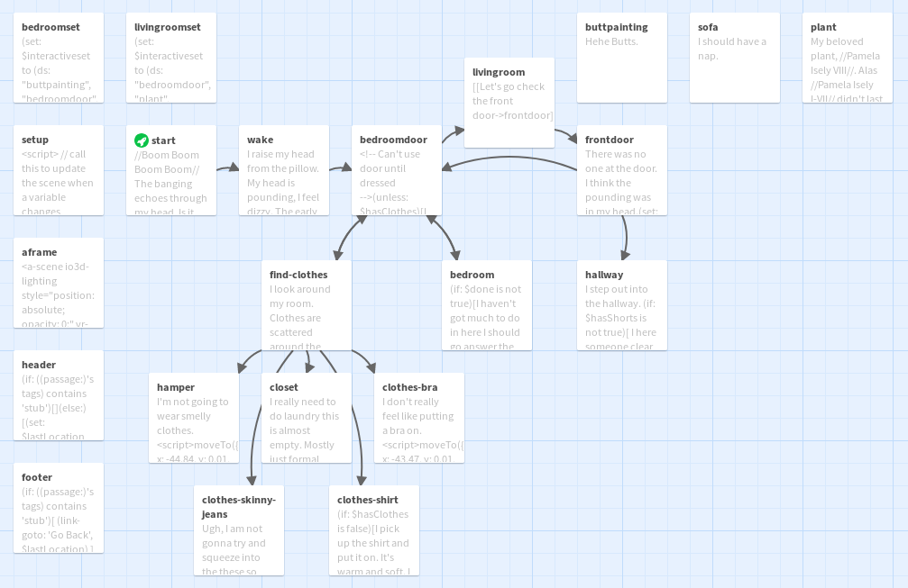
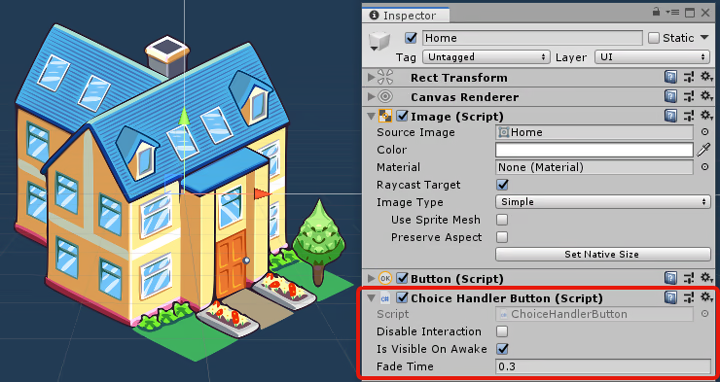
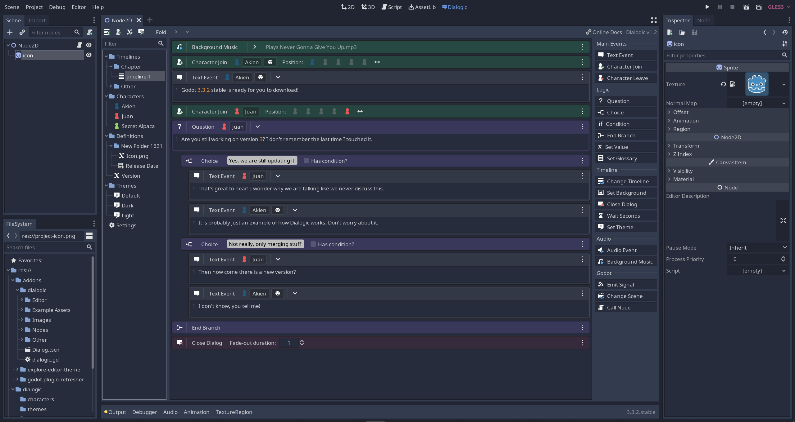

# The Game Engine

While you can use game engines to render your art, you also need to choose one to make your game!

## [Ren'Py](https://www.renpy.org/)

> _The recommended tool for building Visual Novels_

Most devs end up making their games in Ren'Py. It is _the_ most recommended engine because **it is explicitly made for building Visual Novels**. Ren'Py gives an enormous amount of out of the box features (save/load, gallery, settings) while also allowing you to customize when you really need it. While learning programming may seem daunting, Ren'Py is _specifically_ made for non technical folks so most of it is relatively straight forward.

Here's what a standard scene might look like this:

```python
show bg example_happy with dissolve
reader "you're telling me Ren'Py is easy?"
play sound "scoff.mp3"
reader "you're underestimating how stupid I am!"
avocolado "honestly it's pretty straight forward..."
show bg example_unhappy with dissolve
reader "wow, it really is that easy, isn't it"
avocolado "yup! now have fun coding your UI, that's actually awful xD"
play sound "quiet_sobbing.mp3"
jump begin_ui_hell_scene666
```

It's just like writing in English, but with a few extra rules! If you can comprehend this guide, you can understand Ren'Py.

## No Code Builders:

> _For those who just want something that works._

Sometimes the fastest way really _is_ the best way. If you want to get started without any thought process, here are a few tools that get recommended when people talk about no code visual novel builders. It can be guaranteed that one will not get the same level of customization and control that they would get from writing code in Ren'Py.

### [Tyrano Builder](https://tyranobuilder.com/) [Visual Editor Visual Novel Builder]

> 

### [Twine](https://twinery.org/) [Text Based Adventures]

> 

## Game Engines

> For real games that aren't just visual novels.

::: danger CAUTION
Don't use these if you're not already comfortable with programming.
:::
Both of these are reasonable solutions but are not recommended for most due to having to know how to program. While neither of these frameworks have the same out of the box functionality as Ren'Py, you have the entire freedom of a game engine at your fingertips.

### [Unity](https://unity.com/download) with [NaniNovel](https://naninovel.com/guide/) (Paid Service)

> 

::: warning
NaniNovel requires a one time payment to use.
:::

### [Godot](https://godotengine.org/) with [Dialogic](https://github.com/dialogic-godot/dialogic)

> 

::: warning
Dialogic is still a young project and has fewer features compared to other frameworks.
:::
