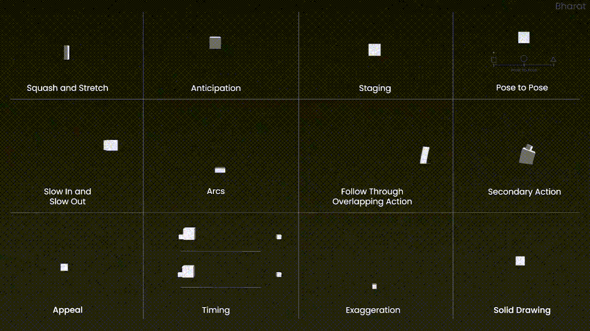

# The H-Scenes

> "I'm not here for the sex, I'm here for the story!"
>
> \~ Cultured AVN Lovers

Unless you're [Summer's Gone](https://www.reddit.com/r/AVN_Lovers/comments/161rvg5/is_summers_gone_light_on_lewd_scenes/), it goes without saying that the sex is going to be an integral part of your story. While there are games that get away with 2D renders of h-scenes, the sex is usually where we see animation come into play. Luckily, all of the aforementioned engines have in-studio tools to help you animate. Here are tutorials for [DAZ](https://www.youtube.com/watch?v=6Q6yAI3mgHU), [Koikatsu](https://www.youtube.com/watch?v=VunJpZNZUKA), and [Honey Select](https://www.youtube.com/watch?v=-hD7PYTI67s). And unless you have experience animating already, you're probably going to want to go over something like [The 12 Principles of Animation](https://www.youtube.com/watch?v=uDqjIdI4bF4) before you get started.

If you've done anything with these engines then by this point you'll have realized that they don't have model collision. All objects, but notably hair, clothing, and genitalia will clip into other objects and characters, making sex particularly awkward for the amateur dev. ITroy shows a solution for DAZ [here](https://vimeo.com/728832587), whereas the Illusion devs use [BetterPenetration](https://github.com/Animal42069/BetterPenetration) to make the penis mesh compress into the orifice. There are pre-set animations both free and paid across the community, but most devs seem to animate the scenes themselves.
