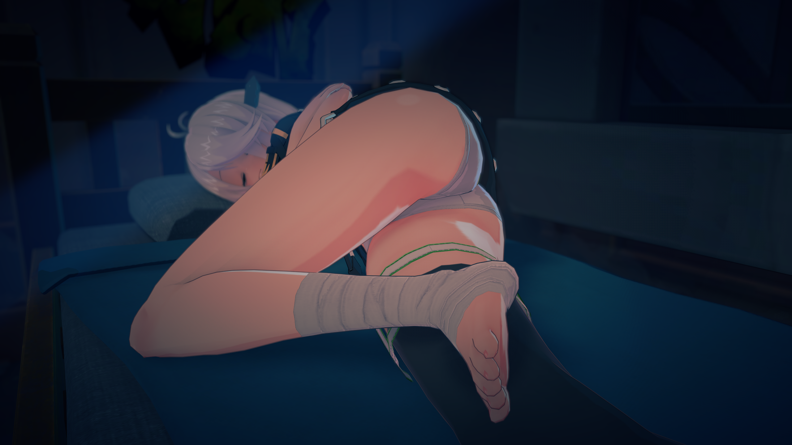
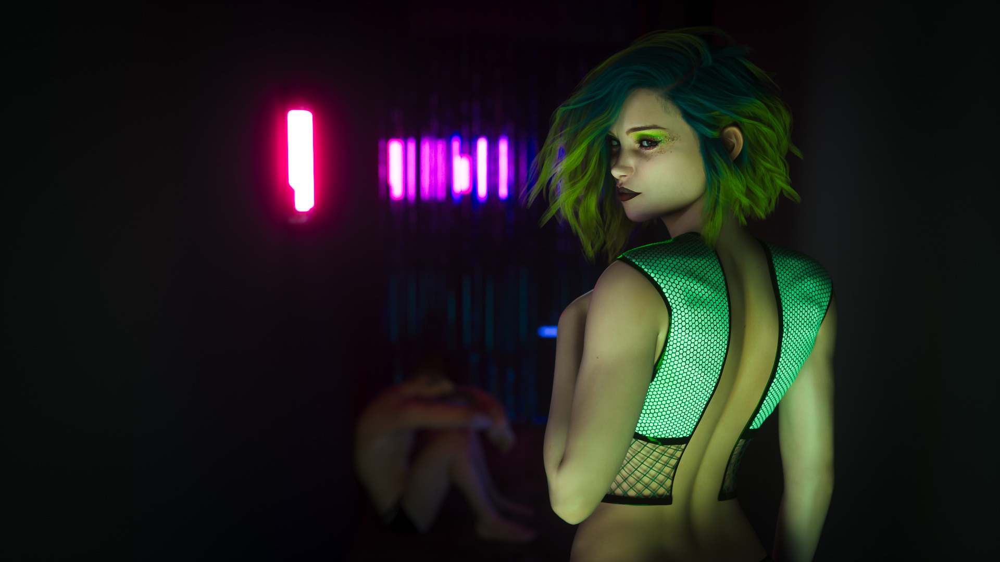

# The Rendering Engine

All of those character model creators additionally serve as 3DCG rendering engines. If you made a character in DAZ, you'll likely pose and render in DAZ Studio. The same applies for Koikatsu and Honey Select. Rendering in Koikatsu and Honey Select is real time so it is instantaneous, whereas rendering in DAZ can take varying amounts of time depending on your hardware and how large your scene is. The time it takes to render between DAZ and Illusion games is _non-negligible_. If you have a very poor PC it's possible that it will take days or weeks to render the scenes that you want for your games.

However while DAZ, Koikatsu, and Honey Select have their own individual setbacks, they're all more than capable of beautiful shots.

### Koikatsu

> 

### Honey Select

> 

### DAZ

> 

If you know more about what you're doing, you might consider exporting your characters from their respective engines and then posing and animating in Blender, Unreal Engine, or even Unity. It can be a little complex so it's not suggested to your average developer and artist.
