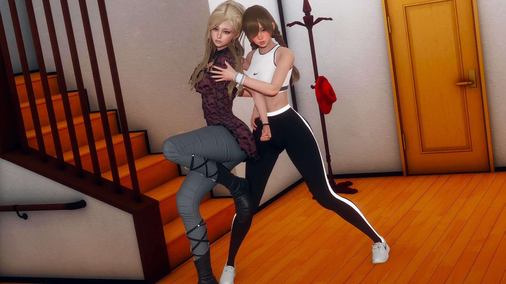
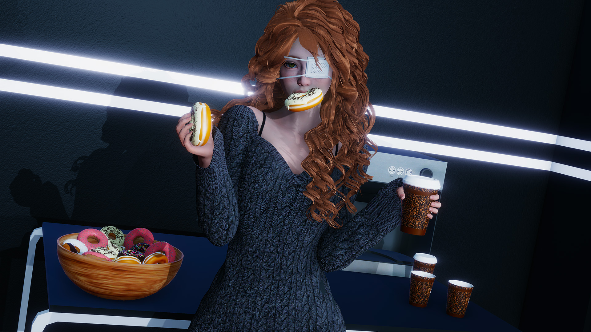

# Scoping your AVN

> Start small project and test the waters. And I mean really fucking small.
>
> \- AVIAN-madness

Creating an AVN much more work than most people imagine and that you will quickly look back at your original work and find it terrible. Choosing a game that is too large in scope will result in you not finishing your game, or if you do, having much worse art at the beginning.

:::info EXAMPLE

### Eternum \[0.1\]

> 

### Eternum \[0.7\]

> 

And Caribdis even had an entire game under his belt before starting Eternum!

:::

The truth of the matter is that most devs don't finish their game. There are so many reasons this might happen, for example:

- The game at the beginning is so bad, I can remake it and do better.
- Developing is a ton of work, I have real life to do.
- I make the game I want it will take over five years to finish...
- Nobody cares what I'm making...

It's to the point where many fans are skeptical of supporting games from new devs because of the mass graveyard of promising but unfinished games. That's why starting small and _finishing_ is **highly recommended**.
